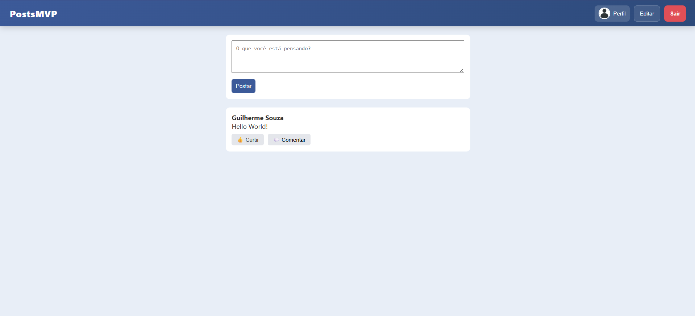
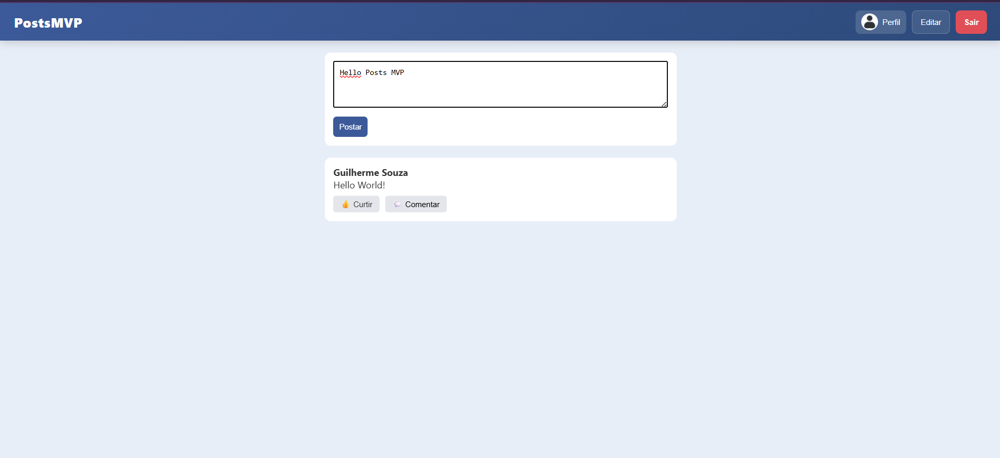
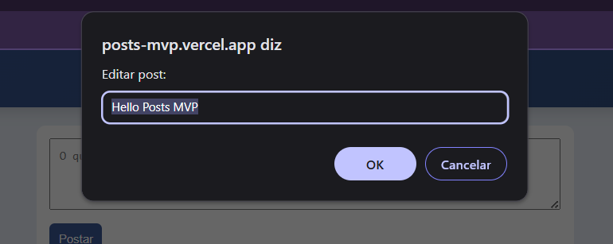
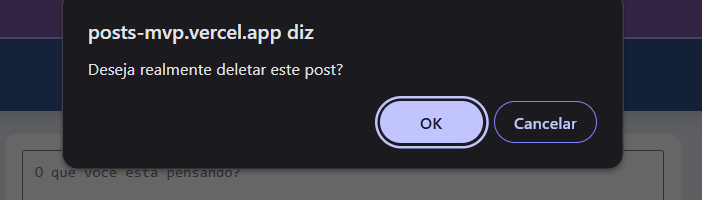

# PostsMVP

> Full stack web application for creating and managing posts — built with React (TypeScript) and Node.js.

## 🎯 Purpose

This project was developed to practice full stack development using React, TypeScript, Node.js and REST APIs.

## 🌐 Live Demo
🔗 https://posts-mvp.vercel.app

## 🚀 Tech Stack

**Frontend**
- React + TypeScript
- CSS Modules

**Backend**
- Node.js + Express
- JavaScript

## 📁 Project Structure

```
PostsMVP/
├── frontend/          # React + TypeScript SPA
└── backend/           # Node.js + Express REST API
```

## ✨ Features

- Create, read, update and delete posts (CRUD)
- RESTful API with separated frontend/backend architecture
- Responsive interface built with React

## 📸 Screenshots


### Home


### Creating a Post


### Post Created


### Editing Post


### Deleting Post



## 🛠️ Getting Started

### Prerequisites

- Node.js 18+
- npm or yarn

### Installation

1. Clone the repository

```bash
git clone https://github.com/Guilhermesouza21/PostsMVP.git
cd PostsMVP
```

2. Install and run the backend

```bash
cd backend
npm install
npm start
```

3. Install and run the frontend

```bash
cd frontend
npm install
npm run dev
```

4. Open [http://localhost:5173](http://localhost:5173) in your browser

## 📚 API Endpoints

| Method | Endpoint      | Description       |
|--------|--------------|-------------------|
| GET    | /posts        | List all posts    |
| POST   | /posts        | Create a post     |
| PUT    | /posts/:id    | Update a post     |
| DELETE | /posts/:id    | Delete a post     |

## 📄 License

This project is open source and available under the [MIT License](LICENSE).

---

Made with ❤️ by [Guilherme Souza](https://github.com/Guilhermesouza21)
